```python
import numpy as np
from qiskit import *
from qiskit import Aer
from qiskit.visualization import plot_state_city
```


```python
# Création d'un circuit quantique à 3 qubits
circ = QuantumCircuit(3)
```


```python
# Porte de Hadamard sur le premier qubit, créant une superposition
circ.h(0)
```


    <qiskit.circuit.instructionset.InstructionSet at 0x235c499ad40>


```python
# Porte de Hadamard sur le troisième qubit, créant une superposition
circ.h(2)
```


    <qiskit.circuit.instructionset.InstructionSet at 0x235c499ac80>


```python
# Apercu du circuit
circ.draw('mpl')
```


    
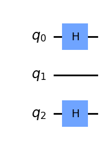
    


```python
# Porte de CNOT (CX) entre le premier et le deuxième qubit
circ.cx(0,1)
```


    <qiskit.circuit.instructionset.InstructionSet at 0x235c6790130>


```python
# Apercu du circuit après l'ajout de la porte CNOT
circ.draw('mpl')
```


    
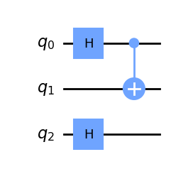
    


```python
# Ajout d'une séparation pour visualiser les différentes parties du circuit
circ.barrier()
```


    <qiskit.circuit.instructionset.InstructionSet at 0x235c687b5e0>


```python
# Apercu du circuit après l'ajout de la séparation
circ.draw('mpl')
```


    
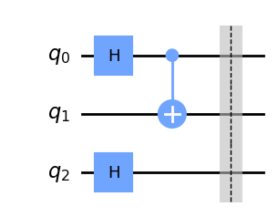
    


```python
# Nouvelle porte de CNOT entre le troisième et le deuxième qubit
circ.cx(2,1)
```


    <qiskit.circuit.instructionset.InstructionSet at 0x235c68c4af0>


```python
# Apercu du circuit après l'ajout de la deuxième porte CNOT
circ.draw('mpl')
```


    
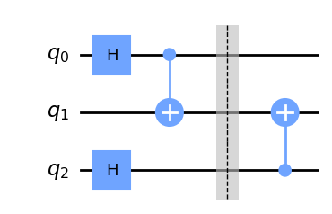
    


```python
# Porte NOT (X) sur le troisième qubit
circ.x(2)
```


    <qiskit.circuit.instructionset.InstructionSet at 0x235c68c7130>


```python
# Apercu du circuit après l'ajout de la porte NOT
circ.draw('mpl')
```


    
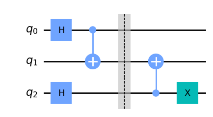
    


```python
# Nouvelle porte de CNOT entre le troisième et le premier qubit
circ.cx(2,0)
```


    <qiskit.circuit.instructionset.InstructionSet at 0x235c6a19510>


```python
# Porte NOT sur le troisième qubit
circ.x(2)
```


    <qiskit.circuit.instructionset.InstructionSet at 0x235c6a18ee0>


```python
# Apercu du circuit après l'ajout de la porte CNOT et NOT
circ.draw('mpl')
```


    
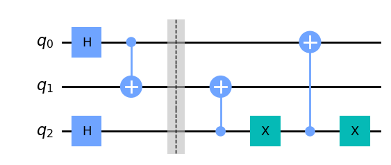
    


```python
# Ajout d'une séparation pour visualiser les différentes parties du circuit
circ.barrier()
```


    <qiskit.circuit.instructionset.InstructionSet at 0x235c6bb4700>


```python
# Permet de permuter les qubits 0 et 1
circ.swap(0,1)
```


    <qiskit.circuit.instructionset.InstructionSet at 0x235c6bb4a60>


```python
# Apercu du circuit après la permutation
circ.draw('mpl')
```


    
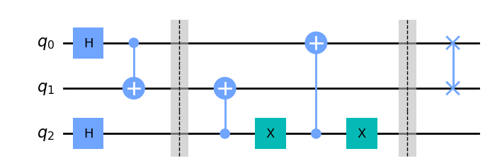
    


```python
# Nouvelle porte de NOT sur le qubit 0 et le qubit 1
circ.x(0)
circ.x(1)
```


    <qiskit.circuit.instructionset.InstructionSet at 0x235c6bb4a30>


```python
# Apercu du circuit après l'ajout des deux portes NOT
circ.draw('mpl')
```


    
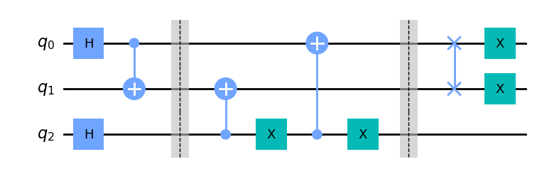
    


```python
# Nouvelle porte de CNOT entre le troisième et le deuxième qubit
circ.cx(2,1)
```


    <qiskit.circuit.instructionset.InstructionSet at 0x235c6a19840>


```python
# Porte NOT sur le troisième qubit
circ.x(2)
```


    <qiskit.circuit.instructionset.InstructionSet at 0x235c68c5540>


```python
# Nouvelle porte de CNOT entre le troisième et le premier qubit
circ.cx(2,0)
```


    <qiskit.circuit.instructionset.InstructionSet at 0x235c68c74c0>


```python
# Porte NOT sur le troisième qubit
circ.x(2)
```


    <qiskit.circuit.instructionset.InstructionSet at 0x235c68c7250>


```python
# Apercu du circuit
circ.draw('mpl')
```


    
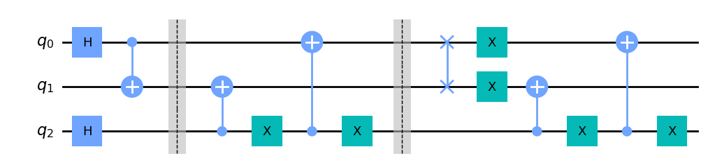
    


```python
# Permet de mesurer tous les qubits du circuit
circ.measure_all()
circ.draw('mpl')
```


    
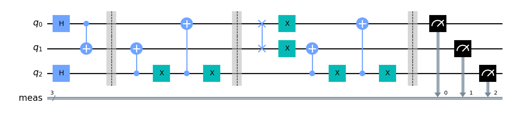
    


```python
# Utilisation du backend 'statevector_simulator' de Qiskit pour simuler le circuit
backend = Aer.get_backend('statevector_simulator')
job = backend.run(circ)
result = job.result()
outputstate = result.get_statevector(circ,decimals=3)
print(outputstate)
# Représentation graphique de l'état final
plot_state_city(outputstate)
```

    Statevector([0.+0.j, 0.+0.j, 0.+0.j, 0.+0.j, 1.+0.j, 0.+0.j, 0.+0.j,
                 0.+0.j],
                dims=(2, 2, 2))
    


    
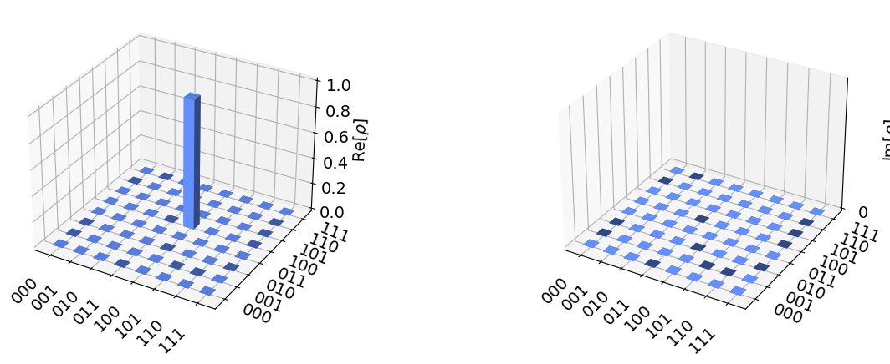
    


